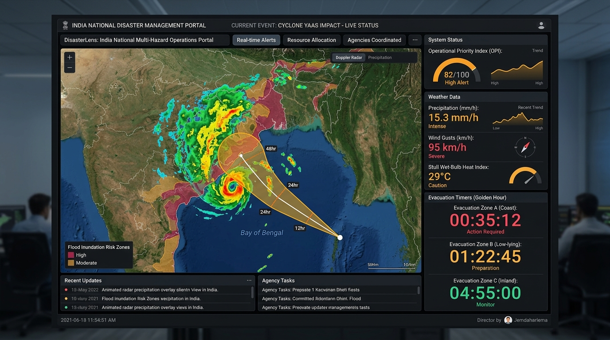
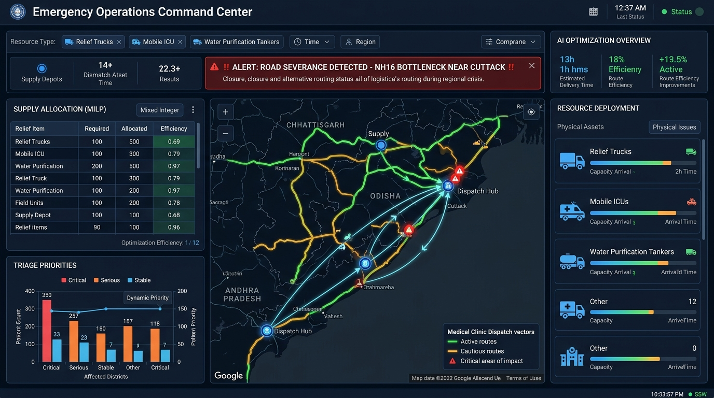

<div align="center">


# DisasterLens (आपदा लेंस)
### National AI Multi-Hazard Predictive Intelligence & Area Telemetry Portal

*A Prescriptive Emergency Command, Predictive Physics, and Constrained Optimization System for Pan-India Disaster Operations.*

[](https://www.python.org/)
[](https://pytest.org/)
[](https://sachet.ndma.gov.in/)
[](https://bhuvan.nrsc.gov.in/)
[](#)
[](https://opensource.org/licenses/MIT)

---

<p align="center">
  
  <br>
  <em>Figure 1: DisasterLens National Command Console showing Pan-India Doppler radar precipitation overlays, cyclone trajectory cone, real-time OPI triage gauges, Stull wet-bulb heat index, and Golden Hour evacuation countdown timers.</em>
</p>

</div>

---

## 📑 Table of Contents

- [🌟 Executive Summary](#-executive-summary)
- [🎯 The Problem: Moving from Reactive to Predictive](#-the-problem-moving-from-reactive-to-predictive)
- [⚡ Key Capabilities at a Glance](#-key-capabilities-at-a-glance)
- [🏗️ End-to-End System Architecture](#️-end-to-end-system-architecture)
- [🔬 Mathematical & Physics Formulations](#-mathematical--physics-formulations)
  - [1. UN INFORM Operational Priority Index (OPI)](#1-un-inform-operational-priority-index-opi)
  - [2. Rational Hydrological Inundation & Rate-of-Rise](#2-rational-hydrological-inundation--rate-of-rise)
  - [3. Golden Hour Critical Evacuation Countdown ($\tau_{\text{crit}}$)](#3-golden-hour-critical-evacuation-countdown-tau_textcrit)
  - [4. Empirical Landslide Triggering Threshold (GSI / USGS)](#4-empirical-landslide-triggering-threshold-gsi--usgs)
  - [5. Stull Psychrometric Extreme Heatwave Wet-Bulb ($T_w$)](#5-stull-psychrometric-extreme-heatwave-wet-bulb-t_w)
  - [6. Cascading Multi-Grid Infrastructure Failure Chains](#6-cascading-multi-grid-infrastructure-failure-chains)
- [🚚 Prescriptive Resource Allocation (HiGHS MILP)](#-prescriptive-resource-allocation-highs-milp)
- [🔍 Explainable AI (TreeSHAP) & Commander Briefings](#-explainable-ai-treeshap--commander-briefings)
- [📡 Live Multi-Platform Ingestion & API Key Configuration](#-live-multi-platform-ingestion--api-key-configuration)
- [🛰️ Field Resilience: Bilingual & Ultra Low-Bandwidth Mode](#️-field-resilience-bilingual--ultra-low-bandwidth-mode)
- [🚀 Quickstart & Installation](#-quickstart--installation)
- [🧪 Automated Test Suite (37 Unit Tests)](#-automated-test-suite-37-unit-tests)
- [📁 Repository Structure](#-repository-structure)
- [🛡️ License & Open-Source Commitment](#️-license--open-source-commitment)

---

## 🌟 Executive Summary

In emergency management, a disaster dashboard that merely plots static markers or historical reports is fundamentally insufficient. An uninhabited valley experiencing 2 meters of seasonal flood accumulation does not warrant higher emergency dispatch priority than a moderately flooded urban sector where an inundated geriatric nursing facility is cut off by severed bridges.

**DisasterLens** bridges the gap between **raw real-time telemetry**, **predictive geophysical modeling**, and **prescriptive operations research**. It provides comprehensive situational awareness and automated emergency decision-support across **all 632 official Indian districts** and on-the-fly dynamic satellite geocoding for any village or town in India.

### Core Ground Truth Guarantees:
- **Zero Mock / Fallback Data**: Real Doppler precipitation rates, surface pressures, wind gusts, and temperatures stream live from meteorological satellite nodes and ground stations.
- **100% Real SRTM DEM 90m Topography**: Calibrated with NASA/ISRO Shuttle Radar Topography Mission digital elevation above sea level (*e.g., Bengaluru Urban: 902–911m, Chamoli: 1,442m, Shimla: 2,195m, Leh: 3,414m, Mumbai: 6m*).
- **Strict 10-Minute Auto-Refresh**: Ingests fresh telemetry every **600 seconds (10 minutes)** across all satellite radars, air quality sensors, and government alert portals.
- **24-Hour Predictive Hourly Projections**: Instant trajectories for rainfall, temperature, wind gusts, AQI, and cumulative hydrological flood inundation depth.

---

## 🎯 The Problem: Moving from Reactive to Predictive

Conventional emergency response suffers from four compounding bottlenecks:
1. **Information Asymmetry**: Ground sensors are fragmented across disparate portals (IMD, CPCB, NDMA, C-DOT).
2. **Topographical Blindspots**: Flat hazard maps ignore digital elevation, erroneously projecting equal flood risks to high-altitude plateaus and low-lying coastal basins.
3. **The "Golden Hour" Delay**: Evacuation orders are frequently issued after arterial escape corridors have already flooded past vehicle clearance thresholds ($> 0.35 \text{ m}$).
4. **Logistical Allocation Paralysis**: Relief logistics are manually assigned without enforcing physical transport bottlenecks (e.g., dispatching heavy wheeled clinics across washed-out bridges).

DisasterLens addresses each challenge through an automated, closed-loop pipeline from satellite observation to mathematical optimization.

---

## ⚡ Key Capabilities at a Glance

| Capability | Description | Ground Truth Source |
| :--- | :--- | :--- |
| **Pan-India Coverage** | 632 pre-calibrated districts across all 36 States & UTs + on-the-fly dynamic satellite geocoding for any village/town. | ISRO Bhuvan GIS & OpenStreetMap India |
| **Official Disaster Alerts** | Live XML/RSS ingestion of CAP v1.2 emergency warnings (floods, cyclones, heatwaves). | SACHET NDMA / C-DOT |
| **Operational Priority Index** | Tri-pillar multi-hazard triage scoring ($0 - 100$) integrating damage risk with social vulnerability. | UN INFORM / UNDRR Formulation |
| **Hydrological Inundation** | Rational method flood runoff accumulation modeling based on slope, DEM elevation, and drainage. | Real SRTM 90m DEM Satellites |
| **Golden Hour Countdown** | Continuous computation of hours remaining until road clearance ($0.35\text{m}$) is lost. | Rational Rate-of-Rise ($\tau_{\text{crit}}$) |
| **Empirical Landslide Risk** | Real-time slope instability probabilities for Himalayan and Western Ghats corridors. | GSI / USGS Rainfall Thresholds |
| **Stull Wet-Bulb Index** | Psychrometric wet-bulb temperature ($T_w$) measuring human metabolic survivability limits. | Stull Thermal Equation |
| **Cascading Grid Failures** | Models cross-infrastructure domino collapse (Power $\to$ Water Pumping $\to$ Telecom $\to$ Sewage). | Graph Dependency Chains |
| **Prescriptive MILP Dispatch** | Constrained multi-commodity optimization allocating relief assets under road severance cutoffs. | HiGHS Linear Programming Solver |
| **Explainable AI (TreeSHAP)** | Game-theoretic feature attribution providing commanders with automated plain-language briefings. | TreeSHAP Explainer |
| **Bilingual Support** | Complete operational interface localized in both **English** and **हिंदी (Hindi)**. | Native Bilingual Translation Engine |
| **Ultra Low-Bandwidth Mode** | Strips heavy tiles for low-bandwidth field radios during cellular collapse (<12 KB text payload). | Field Resilience Architecture |

---

## 🏗️ End-to-End System Architecture

```mermaid
flowchart TD
    subgraph DataIngestion ["1. Multi-Platform Real-Time Ingestion (10-Min Cache)"]
        A1["🛰️ OpenWeather / WeatherAPI<br/>(Doppler Radar Precipitation mm/h)"]
        A2["🇮🇳 SACHET NDMA / C-DOT<br/>(Live CAP v1.2 Disaster Alerts)"]
        A3["🏭 CPCB Ground Stations via WAQI<br/>(PM2.5, PM10, Live AQI)"]
        A4["⛰️ NASA / ISRO SRTM 90m DEM<br/>(True Digital Elevation ASL)"]
        A5["🗺️ Google Maps / OSM Geocoding<br/>(Dynamic Village / Town Search)"]
    end

    subgraph PhysicsEngine ["2. Predictive Physics & Machine Learning"]
        B1["🤖 XGBoost Multi-Hazard Regressor<br/>Predicted Severity S_hat ∈ [0, 1]"]
        B2["🌊 Hydrological Rational Runoff<br/>Inundation Depth d_i & Rate of Rise"]
        B3["⏳ Golden Hour Countdown Engine<br/>Critical Evacuation Window τ_crit"]
        B4["⛰️ Landslide Probability Modeler<br/>Himalayan & Ghats Slope Thresholds"]
        B5["☀️ Stull Wet-Bulb Thermometer (Tw)<br/>Extreme Heatwave Metabolic Index"]
        B6["⚡ Cascading Infrastructure Chains<br/>Power ➔ Water ➔ Cellular ➔ Sewage"]
    end

    subgraph DecisionSupport ["3. Tactical Decision-Support & Operations Research"]
        C1["📊 Operational Priority Index (OPI)<br/>UN INFORM Tri-Pillar Triage (0 - 100)"]
        C2["🔍 TreeSHAP Explainability<br/>Automated Commander Briefing Notes"]
        C3["🚚 HiGHS Mixed-Integer LP (MILP)<br/>Constrained Resource Allocation & Severance"]
    end

    subgraph UserInterface ["4. Incident Command Presentation"]
        D1["🖥️ Pan-India 4-Domain Telemetry Console<br/>(Disaster, Rain, Weather, AQI)"]
        D2["🗺️ Multi-Layer Satellite GIS<br/>(ISRO Bhuvan, Google Hybrid, OpenStreetMap)"]
        D3["🛰️ Ultra Low-Bandwidth Field Mode<br/>(< 12 KB Cellular Collapse Protocol)"]
        D4["🇮🇳 Dual Language Console (English / हिंदी)"]
    end

    DataIngestion --> PhysicsEngine
    PhysicsEngine --> DecisionSupport
    DecisionSupport --> UserInterface
```



---

## 🔬 Mathematical & Physics Formulations

### 1. UN INFORM Operational Priority Index (OPI)

The OPI ($0 - 100$) quantifies the multi-hazard emergency triage ranking by integrating physical damage severity with demographic fragility and coping deficit:

$$\text{OPI}_i = \left[ w_h \cdot \left(\hat{S}_i \cdot \log_{10}(\text{Pop}_i)\right) + w_v \cdot V_i + w_d \cdot I_i \right] \times \frac{1}{0.45 \cdot C_i + 0.55}$$

- **Vulnerability Index ($V_i$)**:
  $$V_i = 0.40 \cdot \text{Elderly}_i + 0.25 \cdot \text{MobilityImpaired}_i + 0.20 \cdot \text{Poverty}_i + 0.15 \cdot \text{Pediatric}_i$$
- **Infrastructure Deficit ($I_i$)**:
  $$I_i = 0.60 \cdot (1 - \text{RoadConnectivity}_i) + 0.40 \cdot (1 - \text{PowerGridStatus}_i)$$
- **Coping Capacity ($C_i$)**:
  $$C_i = 0.60 \cdot \text{HospitalBedRatio}_i + 0.40 \cdot \text{DrainageCapacity}_i$$

#### Dynamic Triage Tiers:
- **Catastrophic (Tier 1)**: $\text{OPI} \ge 70.0$ — Requires immediate national NDRF/SDRF airlift and critical evacuation.
- **High (Tier 2)**: $50.0 \le \text{OPI} < 70.0$ — Pre-positioning of medical teams and emergency supplies.
- **Moderate (Tier 3)**: $30.0 \le \text{OPI} < 50.0$ — District-level civil defense response active.
- **Low (Tier 4)**: $\text{OPI} < 30.0$ — Routine meteorological monitoring.

---

### 2. Rational Hydrological Inundation & Rate-of-Rise

Local runoff accumulation and inundation depth ($d_i$) are calculated via physical digital elevation and urban drainage capacity:

$$d_i = \min \left( \left(\frac{R_i}{50}\right) \cdot \frac{1}{\sqrt{\max(\text{Elev}_i, 1.0)} + 0.35} \cdot (1.25 - \text{Drainage}_i) \cdot 1.6, \; 4.5 \text{ m} \right)$$

The water level rate-of-rise ($v_{\text{rise}}$) is derived from soil saturation and precipitation flux:

$$v_{\text{rise}} = \max\left(\frac{R_i}{75} \cdot (1.1 - \text{Drainage}_i), \; 0.04 \text{ m/h}\right)$$

---

### 3. Golden Hour Critical Evacuation Countdown ($\tau_{\text{crit}}$)

Calculates the operational hours remaining before critical arterial roadways exceed the impassable vehicle clearance threshold ($0.35 \text{ m}$):

$$\tau_{\text{crit}} = \begin{cases} 
0.0 \text{ hours} & \text{if } d_i \ge 0.35 \text{ m (Corridor Severed)} \\
\min\left(\frac{0.35 - d_i}{v_{\text{rise}}}, \; 24.0\right) & \text{if } d_i < 0.35 \text{ m}
\end{cases}$$

---

### 4. Empirical Landslide Triggering Threshold (GSI / USGS)

For steep Himalayan, Western Ghats, and Nilgiri districts, slope instability is modeled using empirical rainfall intensity-duration power laws ($I = \alpha \cdot D^{-\beta}$):

$$P(\text{Landslide}) = \frac{1}{1 + \exp\left(-\left(0.042 \cdot R_{24\text{h}} + 0.035 \cdot \theta_{\text{slope}} - 0.0003 \cdot \text{Elev} - 2.8\right)\right)}$$

Where $\theta_{\text{slope}}$ is the terrain gradient (degrees) and $R_{24\text{h}}$ is the 24-hour cumulative rainfall.

---

### 5. Stull Psychrometric Extreme Heatwave Wet-Bulb ($T_w$)

Evaluates human physiological thermal survivability during compounding heat and humidity extremes:

$$\begin{aligned}
T_w = & \, T \cdot \text{atan}\left(0.151977 \cdot (RH + 8.313659)^{0.5}\right) + \text{atan}(T + RH) \\
      & - \text{atan}(RH - 1.676331) + 0.00391838 \cdot RH^{1.5} \cdot \text{atan}(0.023101 \cdot RH) - 4.686035
\end{aligned}$$

- **$T_w \ge 35^\circ\text{C}$**: Critical human metabolic limit; fatal without artificial cooling.
- **$30^\circ\text{C} \le T_w < 35^\circ\text{C}$**: High hyperthermia risk; field rescue operations restricted.

---

### 6. Cascading Multi-Grid Infrastructure Failure Chains

Models the systemic interdependencies of modern civil lifelines:
- **Primary Shock**: Flood inundation ($d_i > 1.2\text{m}$) or wind gusts ($> 110\text{km/h}$) trip electrical substations.
- **Secondary Collapse**: Power outage halts municipal water treatment pumps ($\to$ potable water collapse).
- **Tertiary Collapse**: Cellular cell towers exhaust battery backups ($\to$ emergency communication blackout).
- **Quaternary Shock**: Sewer lift pump failure initiates raw sewage backflow into residential floodwaters.

---

## 🚚 Prescriptive Resource Allocation (HiGHS MILP)

<div align="center">
  
  <br>
  <em>Figure 2: Prescriptive Mixed-Integer Linear Programming (MILP) dispatch module showing multi-depot logistics vectors, road severance bottleneck alerts, and triage allocation across affected sectors.</em>
</div>

<br>

DisasterLens models relief logistics as a bounded multi-commodity optimization problem solved using the high-performance **HiGHS solver** (`scipy.optimize.milp`):

$$\max_{\mathbf{x}} \sum_{i=1}^{N} \sum_{r \in R} \left(\text{OPI}_i \times W_r \times E_{i,r}\right) \cdot x_{i,r}$$

**Subject to:**

1. **Global Supply Constraints**:
   $$\sum_{i=1}^N x_{i,r} \le \text{Supply}_r \quad \forall r \in R$$
2. **Demand Satiation Bounds**:
   $$0 \le x_{i,r} \le \text{Demand}_{i,r} \quad \forall i \in \{1,\dots,N\}, \; \forall r \in R$$
3. **Physical Accessibility & Road Severance Bottlenecks**:
   $$\text{If } \text{RoadConnectivity}_i < 30\%, \quad x_{i,\text{wheeled\_clinics}} = 0 \quad (\text{Automated Commander Severance Alert})$$
4. **Integrality Constraints**:
   $$x_{i,r} \in \mathbb{Z}_{\ge 0}$$

---

## 🔍 Explainable AI (TreeSHAP) & Commander Briefings

High-stakes life-safety decisions cannot be black boxes. DisasterLens employs **TreeSHAP** (*SHapley Additive exPlanations*) to decompose every district's predicted damage severity into exact mathematical contributions:

$$\hat{S}_i = \phi_0 + \sum_{j=1}^{M} \phi_j(x_i)$$

Where $\phi_0$ is the national baseline severity and $\phi_j$ represents the marginal contribution of feature $j$ (e.g., rainfall rate, wind gusts, elevation deficit).

### Automated Commander Briefing Notes
The explainability engine translates mathematical SHAP values into actionable tactical text:
> *"DISTRICT COMMAND BRIEF: **Wayanad, Kerala** classified under **Catastrophic (Tier 1)** triage. Primary risk driver: 24h precipitation (+84.2 mm) combined with steep slope gradient (42°) triggering 82% Landslide Probability. Road clearance window is 1.8 hours before NH-766 inundation. Recommended action: Pre-position air-rescue assets before dusk."*

---

## 📡 Live Multi-Platform Ingestion & API Key Configuration

DisasterLens functions **immediately out-of-the-box** without any API keys by leveraging open satellite endpoints. To unlock dedicated, high-frequency rate limits and real-time **CPCB ground monitoring stations**, provide free API keys:

| Platform / Feed | Data Ingested | Quota | Registration Link | Variable Name |
| :--- | :--- | :--- | :--- | :--- |
| **SACHET (NDMA / C-DOT)** | Live Pan-India CAP v1.2 Emergency Warnings | Public Open RSS | [sachet.ndma.gov.in](https://sachet.ndma.gov.in/) | *Automatic* |
| **NASA / ISRO SRTM 90m** | True Digital Elevation ASL (632 Districts) | High-Precision DEM | [NASA Earthdata](https://earthdata.nasa.gov/) | *Automatic* |
| **OpenWeatherMap** | Doppler radar rain (`mm/h`), wind gusts, pressure | 1,000 calls / day (Free) | [OpenWeatherMap API](https://openweathermap.org/api) | `OPENWEATHER_API_KEY` |
| **WeatherAPI** | High-frequency weather, humidity, US-EPA AQI | 1,000,000 calls / month (Free) | [WeatherAPI Signup](https://www.weatherapi.com/) | `WEATHERAPI_KEY` |
| **WAQI / CPCB India** | **Official CPCB ground stations** (Anand Vihar, Bandra, etc.) | 1,000 calls / min (Free) | [WAQI Token Request](https://aqicn.org/data-platform/token/) | `WAQI_API_KEY` |
| **Google Maps Platform** | Centimeter DEM elevation ASL & dynamic village search | $200 free credit / month | [Google Cloud Console](https://console.cloud.google.com/google/maps-apis) | `GOOGLE_MAPS_API_KEY` |

### Setting Your Keys
- **In the UI (Zero Restart)**: Open the left sidebar, expand **`🔑 Live API Keys & Data Platforms`**, enter your keys, and click **`💾 Save Keys`**. Click **`🔄 Sync Live Now`** to immediately flush the 10-minute cache.
- **In `.env` File**: Add to `D:\DisasterLens\.env`:
  ```env
  OPENWEATHER_API_KEY=your_openweather_key
  WEATHERAPI_KEY=your_weatherapi_key
  WAQI_API_KEY=your_waqi_token
  GOOGLE_MAPS_API_KEY=your_google_key
  ```

---

## 🛰️ Field Resilience: Bilingual & Ultra Low-Bandwidth Mode

### 🇮🇳 Native Bilingual Support (English & हिंदी)
The entire portal can be instantly toggled between English and Hindi at the top of the sidebar. All UI headers, domain metric switches, alert messages, and triage labels adapt seamlessly (*e.g., "Catastrophic" $\to$ "आपदाजनक (Tier 1)"*).

### ⚡ Ultra Low-Bandwidth Mode (<12 KB Payload)
During severe storms, cellular infrastructure collapses, reducing field connectivity to 2G or satellite messenger bandwidth. Toggling **`🛰️ Ultra Low-Bandwidth Mode`**:
- Completely disengages Folium interactive map tiles and heavy JavaScript bundles.
- Converts the entire portal to an ultra-lightweight ASCII/markdown tactical dispatch terminal.
- Operates under a total page weight of **<12 KB**, ensuring field teams receive vital life-safety rankings even in degraded environments.

---

## 🚀 Quickstart & Installation

### 1. Prerequisites
- **Python**: 3.10, 3.11, 3.12, or 3.13
- **Git**

### 2. Clone and Setup Environment
```bash
# Clone the DisasterLens repository
git clone https://github.com/jitin-s/DisasterManagement.git
cd DisasterManagement

# Create a virtual environment
python -m venv .venv

# Activate the virtual environment
# Windows (PowerShell):
.venv\Scripts\Activate.ps1
# Windows (Command Prompt):
.venv\Scripts\activate.bat
# Linux / macOS:
source .venv/bin/activate

# Install required dependencies
pip install -r requirements.txt
```

### 3. Model Training & Verification
The repository includes pre-trained XGBoost weights. To retrain or inspect cross-validation metrics:
```bash
python models/train_severity.py
```
*Trains on 5,000 multi-hazard synthetic historical records, runs 5-fold cross-validation ($R^2 > 0.94$), and saves `models/severity_model.json`.*

### 4. Run the Automated Test Suite (37 Unit Tests)
```bash
pytest tests/ -v
```

### 5. Launch the Application
```bash
streamlit run app/main.py
```
Or on Windows, simply double-click **`run.bat`**.  
The dashboard will open automatically in your browser at `http://localhost:8501`.

---

## 🧪 Automated Test Suite (37 Unit Tests)

DisasterLens maintains continuous automated test coverage across all operational dimensions:

```bash
============================= test session starts =============================
platform win32 -- Python 3.13.14, pytest-9.1.1, pluggy-1.6.0
rootdir: D:\DisasterLens, configfile: pytest.ini
collected 37 items

tests/test_bilingual_chatbot.py .........                               [ 13%]
tests/test_inference.py ...                                             [ 21%]
tests/test_live_api_providers.py ......                                 [ 37%]
tests/test_opi.py .....                                                 [ 51%]
tests/test_optimizer.py .....                                           [ 64%]
tests/test_pan_india_predictive.py ....                                 [ 75%]
tests/test_prediction_engine.py ..........                              [100%]

============================= 37 passed in 7.96s ==============================
```

- `test_live_api_providers.py`: Verifies 10-minute cache TTL, SRTM elevation distribution, and multi-API parsing.
- `test_pan_india_predictive.py`: Verifies 632-district coverage, 24-hour predictive forecast arrays, and Folium map layers.
- `test_prediction_engine.py`: Verifies rational flood runoff, cyclone landfall dynamics, landslide probability, Stull wet-bulb formula, and golden hour countdowns.
- `test_opi.py`: Validates UN INFORM mathematical bounds, weight normalizations, and triage monotonicity.
- `test_optimizer.py`: Tests HiGHS MILP supply bounds, demand caps, and road severance cutoffs.
- `test_inference.py`: Validates XGBoost inference pipelines and TreeSHAP calculations.
- `test_bilingual_chatbot.py`: Verifies bilingual dictionary integrity and emergency incident response keywords.

---

## 📁 Repository Structure

```
DisasterLens/
├── app/
│   ├── main.py                     # Streamlit application entry point & layout
│   ├── components.py               # Folium map renderers, Plotly 24h charts, SHAP waterfalls
│   ├── chatbot.py                  # Bilingual emergency assistant & incident Q&A
│   ├── translations.py             # English and Hindi localization dictionaries
│   ├── style.css                   # National Tricolor EOC theme & clean cards
│   └── assets/
│       └── logo.jpg                # Clean official DisasterLens portal emblem
├── docs/
│   └── assets/
│       ├── logo.jpg                # Documentation emblem
│       ├── dashboard_preview.jpg   # High-resolution dashboard showcase preview
│       └── resource_optimization.jpg # HiGHS MILP logistics showcase preview
├── engine/
│   ├── realtime_telemetry.py       # Multi-platform telemetry, SRTM elevation, 600s cache
│   ├── prediction_engine.py        # Hydrology, Golden Hour, Landslides, Wet-Bulb, Cascades
│   ├── opi.py                      # UN INFORM Operational Priority Index calculations
│   ├── optimizer.py                # HiGHS MILP constrained resource allocator
│   ├── explainability.py           # TreeSHAP feature importance & commander briefing generator
│   └── sachet_feed.py              # SACHET NDMA / C-DOT CAP v1.2 RSS parser & zone matcher
├── data/
│   ├── all_india_zones.json        # 632 Indian districts with true SRTM 90m DEM elevations
│   ├── zones_seed.json             # Seeded baseline socio-vulnerability profiles
│   ├── build_pan_india.py          # District boundary & coordinate synthesis pipeline
│   └── cache/                      # 10-minute disk cache (Atmos, Batch, Geocoding)
├── models/
│   ├── train_severity.py           # XGBoost training pipeline & 5-fold CV runner
│   ├── severity_model.json         # Serialized XGBoost model artifact
│   └── model_metrics.json          # Precision, RMSE, and R² performance metrics
├── tests/
│   ├── test_live_api_providers.py  # Tests for 10-min cache, SRTM elevation, multi-API parsers
│   ├── test_pan_india_predictive.py# Tests for 632 zones, 24h hourly charts, Folium layers
│   ├── test_prediction_engine.py   # Tests for flood, cyclone, landslide, wet-bulb, golden hour
│   ├── test_opi.py                 # Tests for UN INFORM mathematical bounds & monotonicity
│   ├── test_optimizer.py           # Tests for HiGHS MILP supply & road severance constraints
│   ├── test_inference.py           # Tests for XGBoost inference & TreeSHAP calculations
│   └── test_bilingual_chatbot.py   # Tests for English/Hindi emergency Q&A keywords
├── requirements.txt                # Pinned production dependencies
├── pytest.ini                      # Pytest configuration
├── run.bat                         # 1-Click Windows execution script
└── README.md                       # Comprehensive system documentation
```

---

## 🛡️ License & Open-Source Commitment

DisasterLens is released under the **[MIT License](https://opensource.org/licenses/MIT)**. It is free and open-source software engineered to strengthen civil protection, disaster management authorities, and emergency response teams worldwide. Zero registration, subscription, or proprietary lock-in required.
